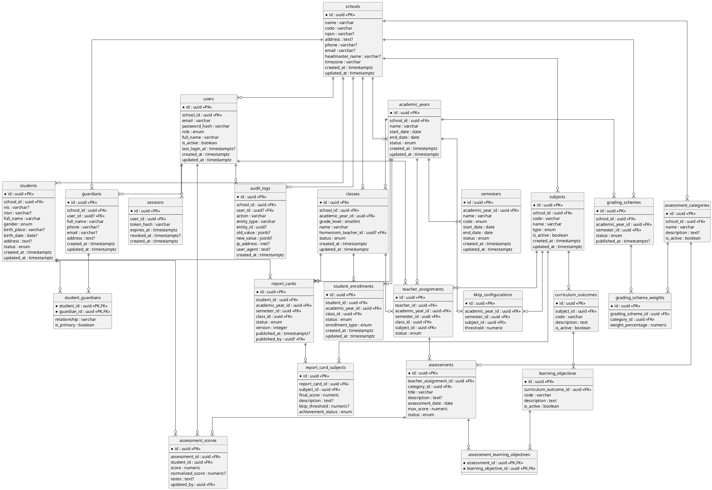

# SPEC-001 — Implementation Specification Sistem Nilai & Rapor SD

## 0. Engineering Decisions

| Area           | Keputusan                                       |
| -------------- | ----------------------------------------------- |
| Architecture   | Modular Monolith                                |
| Frontend       | Next.js + TypeScript                            |
| Backend        | NestJS + TypeScript                             |
| Database       | PostgreSQL                                      |
| ORM            | Prisma 7                                        |
| API            | REST/JSON                                       |
| API contract   | OpenAPI 3.1.x                                   |
| Authentication | HTTP-only Secure Session Cookie                 |
| ID             | UUID                                            |
| Time           | UTC di database, timezone sekolah untuk display |
| File import    | CSV/XLSX                                        |
| PDF            | Chromium-based renderer                         |
| Testing        | Unit + Integration + E2E                        |
| Deployment     | Docker                                          |
| Repository     | Monorepo                                        |

> `Prisma migrations` harus disimpan di source control. Migration SQL yang membutuhkan PostgreSQL-specific features boleh dikustomisasi secara manual. Prisma mendukung migration files yang dapat diedit dan tetap digunakan sebagai history database.

---

# PART I — DATABASE

# 1. Database Conventions

Semua tabel menggunakan:

```sql
id UUID PRIMARY KEY
created_at TIMESTAMPTZ NOT NULL DEFAULT now()
updated_at TIMESTAMPTZ NOT NULL DEFAULT now()
```

Kecuali tabel audit/session yang memiliki aturan khusus.

### Naming

Database:

```text
snake_case
```

Contoh:

```text
student_enrollments
assessment_scores
report_card_subjects
```

Enum menggunakan uppercase di PostgreSQL/Prisma layer:

```text
SUPERADMIN
TEACHER
PARENT
```

---

# 2. Entity Relationship Diagram



---

# 3. PostgreSQL Initial Migration

Migration `001_init.sql` harus menghasilkan struktur berikut.

## 3.1 Extensions

```sql
CREATE EXTENSION IF NOT EXISTS pgcrypto;
```

UUID dibuat menggunakan:

```sql
gen_random_uuid()
```

---

## 3.2 Enums

```sql
CREATE TYPE user_role AS ENUM (
  'SUPERADMIN',
  'TEACHER',
  'PARENT'
);

CREATE TYPE academic_year_status AS ENUM (
  'DRAFT',
  'ACTIVE',
  'ARCHIVED'
);

CREATE TYPE semester_code AS ENUM (
  'ODD',
  'EVEN'
);

CREATE TYPE semester_status AS ENUM (
  'DRAFT',
  'ACTIVE',
  'CLOSED'
);

CREATE TYPE student_status AS ENUM (
  'ACTIVE',
  'GRADUATED',
  'TRANSFERRED',
  'INACTIVE'
);

CREATE TYPE gender AS ENUM (
  'MALE',
  'FEMALE'
);

CREATE TYPE enrollment_status AS ENUM (
  'ACTIVE',
  'COMPLETED',
  'CANCELLED'
);

CREATE TYPE enrollment_type AS ENUM (
  'NEW',
  'PROMOTED',
  'REPEATED',
  'TRANSFERRED'
);

CREATE TYPE subject_type AS ENUM (
  'MANDATORY',
  'ADDITIONAL',
  'LOCAL'
);

CREATE TYPE assignment_status AS ENUM (
  'ACTIVE',
  'INACTIVE'
);

CREATE TYPE grading_scheme_status AS ENUM (
  'DRAFT',
  'PUBLISHED',
  'ARCHIVED'
);

CREATE TYPE assessment_status AS ENUM (
  'DRAFT',
  'PUBLISHED',
  'CLOSED'
);

CREATE TYPE report_card_status AS ENUM (
  'DRAFT',
  'REVIEW',
  'LOCKED',
  'PUBLISHED',
  'REVISION'
);

CREATE TYPE achievement_status AS ENUM (
  'ACHIEVED',
  'NOT_ACHIEVED',
  'NOT_ASSESSED'
);
```

---

# 4. Core Tables

## schools

```sql
CREATE TABLE schools (
  id UUID PRIMARY KEY DEFAULT gen_random_uuid(),
  name VARCHAR(200) NOT NULL,
  code VARCHAR(50),
  npsn VARCHAR(30),
  address TEXT,
  phone VARCHAR(50),
  email VARCHAR(255),
  headmaster_name VARCHAR(200),
  timezone VARCHAR(100) NOT NULL DEFAULT 'Asia/Jakarta',
  created_at TIMESTAMPTZ NOT NULL DEFAULT now(),
  updated_at TIMESTAMPTZ NOT NULL DEFAULT now()
);
```

Karena satu database hanya mewakili satu sekolah, aplikasi production harus melakukan bootstrap tepat satu record `schools`.

---

# 5. Users & Sessions

```sql
CREATE TABLE users (
  id UUID PRIMARY KEY DEFAULT gen_random_uuid(),
  school_id UUID NOT NULL REFERENCES schools(id),
  email VARCHAR(255) NOT NULL,
  password_hash TEXT NOT NULL,
  role user_role NOT NULL,
  full_name VARCHAR(200) NOT NULL,
  is_active BOOLEAN NOT NULL DEFAULT true,
  last_login_at TIMESTAMPTZ,
  created_at TIMESTAMPTZ NOT NULL DEFAULT now(),
  updated_at TIMESTAMPTZ NOT NULL DEFAULT now(),

  CONSTRAINT uq_users_school_email
    UNIQUE (school_id, email)
);
```

```sql
CREATE TABLE sessions (
  id UUID PRIMARY KEY DEFAULT gen_random_uuid(),
  user_id UUID NOT NULL REFERENCES users(id) ON DELETE CASCADE,
  token_hash TEXT NOT NULL UNIQUE,
  expires_at TIMESTAMPTZ NOT NULL,
  revoked_at TIMESTAMPTZ,
  created_at TIMESTAMPTZ NOT NULL DEFAULT now()
);
```

Session cookie hanya menyimpan opaque session identifier.

---

# 6. Students

```sql
CREATE TABLE students (
  id UUID PRIMARY KEY DEFAULT gen_random_uuid(),
  school_id UUID NOT NULL REFERENCES schools(id),
  nis VARCHAR(50),
  nisn VARCHAR(50),
  full_name VARCHAR(200) NOT NULL,
  gender gender,
  birth_place VARCHAR(100),
  birth_date DATE,
  address TEXT,
  status student_status NOT NULL DEFAULT 'ACTIVE',
  created_at TIMESTAMPTZ NOT NULL DEFAULT now(),
  updated_at TIMESTAMPTZ NOT NULL DEFAULT now(),

  CONSTRAINT uq_student_school_nis
    UNIQUE (school_id, nis)
);
```

NIS boleh nullable karena tidak semua deployment harus menggunakan NIS.

---

# 7. Guardians

```sql
CREATE TABLE guardians (
  id UUID PRIMARY KEY DEFAULT gen_random_uuid(),
  school_id UUID NOT NULL REFERENCES schools(id),
  user_id UUID UNIQUE REFERENCES users(id),
  full_name VARCHAR(200) NOT NULL,
  phone VARCHAR(50),
  email VARCHAR(255),
  address TEXT,
  created_at TIMESTAMPTZ NOT NULL DEFAULT now(),
  updated_at TIMESTAMPTZ NOT NULL DEFAULT now()
);
```

```sql
CREATE TABLE student_guardians (
  student_id UUID NOT NULL REFERENCES students(id) ON DELETE CASCADE,
  guardian_id UUID NOT NULL REFERENCES guardians(id) ON DELETE CASCADE,
  relationship VARCHAR(50) NOT NULL,
  is_primary BOOLEAN NOT NULL DEFAULT false,

  PRIMARY KEY (student_id, guardian_id)
);
```

---

# 8. Academic Year & Semester

```sql
CREATE TABLE academic_years (
  id UUID PRIMARY KEY DEFAULT gen_random_uuid(),
  school_id UUID NOT NULL REFERENCES schools(id),
  name VARCHAR(20) NOT NULL,
  start_date DATE NOT NULL,
  end_date DATE NOT NULL,
  status academic_year_status NOT NULL DEFAULT 'DRAFT',
  created_at TIMESTAMPTZ NOT NULL DEFAULT now(),
  updated_at TIMESTAMPTZ NOT NULL DEFAULT now(),

  CONSTRAINT chk_academic_year_dates
    CHECK (start_date < end_date),

  CONSTRAINT uq_academic_year_name
    UNIQUE (school_id, name)
);
```

Hanya satu active year:

```sql
CREATE UNIQUE INDEX uq_one_active_academic_year
ON academic_years (school_id)
WHERE status = 'ACTIVE';
```

Semester:

```sql
CREATE TABLE semesters (
  id UUID PRIMARY KEY DEFAULT gen_random_uuid(),
  academic_year_id UUID NOT NULL REFERENCES academic_years(id),
  name VARCHAR(50) NOT NULL,
  code semester_code NOT NULL,
  start_date DATE NOT NULL,
  end_date DATE NOT NULL,
  status semester_status NOT NULL DEFAULT 'DRAFT',
  created_at TIMESTAMPTZ NOT NULL DEFAULT now(),
  updated_at TIMESTAMPTZ NOT NULL DEFAULT now(),

  CONSTRAINT chk_semester_dates
    CHECK (start_date < end_date),

  CONSTRAINT uq_semester_year_code
    UNIQUE (academic_year_id, code)
);
```

---

# 9. Classes & Enrollment

```sql
CREATE TABLE classes (
  id UUID PRIMARY KEY DEFAULT gen_random_uuid(),
  school_id UUID NOT NULL REFERENCES schools(id),
  academic_year_id UUID NOT NULL REFERENCES academic_years(id),
  grade_level SMALLINT NOT NULL,
  name VARCHAR(50) NOT NULL,
  homeroom_teacher_id UUID REFERENCES users(id),
  status VARCHAR(20) NOT NULL DEFAULT 'ACTIVE',
  created_at TIMESTAMPTZ NOT NULL DEFAULT now(),
  updated_at TIMESTAMPTZ NOT NULL DEFAULT now(),

  CONSTRAINT chk_grade_level
    CHECK (grade_level BETWEEN 1 AND 6),

  CONSTRAINT uq_class_year_name
    UNIQUE (academic_year_id, name)
);
```

Enrollment:

```sql
CREATE TABLE student_enrollments (
  id UUID PRIMARY KEY DEFAULT gen_random_uuid(),
  student_id UUID NOT NULL REFERENCES students(id),
  academic_year_id UUID NOT NULL REFERENCES academic_years(id),
  class_id UUID NOT NULL REFERENCES classes(id),
  status enrollment_status NOT NULL DEFAULT 'ACTIVE',
  enrollment_type enrollment_type NOT NULL,
  created_at TIMESTAMPTZ NOT NULL DEFAULT now(),
  updated_at TIMESTAMPTZ NOT NULL DEFAULT now(),

  CONSTRAINT uq_student_one_class_per_year
    UNIQUE (student_id, academic_year_id)
);
```

---

# 10. Subjects, CP & TP

```sql
CREATE TABLE subjects (
  id UUID PRIMARY KEY DEFAULT gen_random_uuid(),
  school_id UUID NOT NULL REFERENCES schools(id),
  code VARCHAR(50) NOT NULL,
  name VARCHAR(200) NOT NULL,
  type subject_type NOT NULL,
  is_active BOOLEAN NOT NULL DEFAULT true,
  created_at TIMESTAMPTZ NOT NULL DEFAULT now(),
  updated_at TIMESTAMPTZ NOT NULL DEFAULT now(),

  CONSTRAINT uq_subject_code
    UNIQUE (school_id, code)
);
```

```sql
CREATE TABLE curriculum_outcomes (
  id UUID PRIMARY KEY DEFAULT gen_random_uuid(),
  subject_id UUID NOT NULL REFERENCES subjects(id) ON DELETE CASCADE,
  code VARCHAR(50) NOT NULL,
  description TEXT NOT NULL,
  is_active BOOLEAN NOT NULL DEFAULT true,

  CONSTRAINT uq_cp_subject_code
    UNIQUE (subject_id, code)
);
```

```sql
CREATE TABLE learning_objectives (
  id UUID PRIMARY KEY DEFAULT gen_random_uuid(),
  curriculum_outcome_id UUID NOT NULL
    REFERENCES curriculum_outcomes(id) ON DELETE CASCADE,
  code VARCHAR(50) NOT NULL,
  description TEXT NOT NULL,
  is_active BOOLEAN NOT NULL DEFAULT true,

  CONSTRAINT uq_tp_cp_code
    UNIQUE (curriculum_outcome_id, code)
);
```

---

# 11. Teacher Assignment

```sql
CREATE TABLE teacher_assignments (
  id UUID PRIMARY KEY DEFAULT gen_random_uuid(),
  teacher_id UUID NOT NULL REFERENCES users(id),
  academic_year_id UUID NOT NULL REFERENCES academic_years(id),
  semester_id UUID NOT NULL REFERENCES semesters(id),
  class_id UUID NOT NULL REFERENCES classes(id),
  subject_id UUID NOT NULL REFERENCES subjects(id),
  status assignment_status NOT NULL DEFAULT 'ACTIVE',
  created_at TIMESTAMPTZ NOT NULL DEFAULT now(),
  updated_at TIMESTAMPTZ NOT NULL DEFAULT now(),

  CONSTRAINT uq_teacher_assignment
    UNIQUE (
      teacher_id,
      semester_id,
      class_id,
      subject_id
    )
);
```

Backend wajib memastikan:

```text
teacher.role = TEACHER
semester.academic_year_id = assignment.academic_year_id
class.academic_year_id = assignment.academic_year_id
```

---

# 12. Assessment Categories

```sql
CREATE TABLE assessment_categories (
  id UUID PRIMARY KEY DEFAULT gen_random_uuid(),
  school_id UUID NOT NULL REFERENCES schools(id),
  name VARCHAR(100) NOT NULL,
  description TEXT,
  is_active BOOLEAN NOT NULL DEFAULT true,
  created_at TIMESTAMPTZ NOT NULL DEFAULT now(),
  updated_at TIMESTAMPTZ NOT NULL DEFAULT now(),

  CONSTRAINT uq_assessment_category
    UNIQUE (school_id, name)
);
```

Default seed:

```text
Formatif
Sumatif
Tugas
Proyek
Praktik
Ulangan/Tes
Portofolio
```

---

# 13. Grading Scheme

Header:

```sql
CREATE TABLE grading_schemes (
  id UUID PRIMARY KEY DEFAULT gen_random_uuid(),
  school_id UUID NOT NULL REFERENCES schools(id),
  academic_year_id UUID NOT NULL REFERENCES academic_years(id),
  semester_id UUID NOT NULL REFERENCES semesters(id),
  status grading_scheme_status NOT NULL DEFAULT 'DRAFT',
  published_at TIMESTAMPTZ,
  created_at TIMESTAMPTZ NOT NULL DEFAULT now(),
  updated_at TIMESTAMPTZ NOT NULL DEFAULT now(),

  CONSTRAINT uq_grading_scheme
    UNIQUE (academic_year_id, semester_id)
);
```

Detail:

```sql
CREATE TABLE grading_scheme_weights (
  id UUID PRIMARY KEY DEFAULT gen_random_uuid(),
  grading_scheme_id UUID NOT NULL
    REFERENCES grading_schemes(id) ON DELETE CASCADE,
  category_id UUID NOT NULL
    REFERENCES assessment_categories(id),
  weight_percentage NUMERIC(5,2) NOT NULL,

  CONSTRAINT uq_scheme_category
    UNIQUE (grading_scheme_id, category_id),

  CONSTRAINT chk_weight
    CHECK (
      weight_percentage >= 0
      AND weight_percentage <= 100
    )
);
```

Total weight = 100% harus divalidasi dalam transaction ketika `grading_scheme.status` berubah menjadi `PUBLISHED`.

Tidak diperbolehkan mengubah weight dari scheme yang sudah published.

---

# 14. Assessments

```sql
CREATE TABLE assessments (
  id UUID PRIMARY KEY DEFAULT gen_random_uuid(),
  teacher_assignment_id UUID NOT NULL
    REFERENCES teacher_assignments(id),
  category_id UUID NOT NULL
    REFERENCES assessment_categories(id),
  title VARCHAR(200) NOT NULL,
  description TEXT,
  assessment_date DATE NOT NULL,
  max_score NUMERIC(7,2) NOT NULL,
  status assessment_status NOT NULL DEFAULT 'DRAFT',
  created_at TIMESTAMPTZ NOT NULL DEFAULT now(),
  updated_at TIMESTAMPTZ NOT NULL DEFAULT now(),

  CONSTRAINT chk_max_score
    CHECK (max_score > 0)
);
```

Assessment → TP:

```sql
CREATE TABLE assessment_learning_objectives (
  assessment_id UUID NOT NULL
    REFERENCES assessments(id) ON DELETE CASCADE,
  learning_objective_id UUID NOT NULL
    REFERENCES learning_objectives(id),

  PRIMARY KEY (assessment_id, learning_objective_id)
);
```

---

# 15. Assessment Scores

```sql
CREATE TABLE assessment_scores (
  id UUID PRIMARY KEY DEFAULT gen_random_uuid(),
  assessment_id UUID NOT NULL
    REFERENCES assessments(id) ON DELETE CASCADE,
  student_id UUID NOT NULL
    REFERENCES students(id),
  score NUMERIC(7,2) NOT NULL,
  normalized_score NUMERIC(5,2),
  notes TEXT,
  updated_by UUID NOT NULL REFERENCES users(id),
  created_at TIMESTAMPTZ NOT NULL DEFAULT now(),
  updated_at TIMESTAMPTZ NOT NULL DEFAULT now(),

  CONSTRAINT uq_assessment_student
    UNIQUE (assessment_id, student_id),

  CONSTRAINT chk_score_nonnegative
    CHECK (score >= 0),

  CONSTRAINT chk_normalized_score
    CHECK (
      normalized_score IS NULL
      OR (
        normalized_score >= 0
        AND normalized_score <= 100
      )
    )
);
```

Backend wajib memastikan:

```text
score <= assessment.max_score
```

---

# 16. KKTP

```sql
CREATE TABLE kktp_configurations (
  id UUID PRIMARY KEY DEFAULT gen_random_uuid(),
  academic_year_id UUID NOT NULL REFERENCES academic_years(id),
  semester_id UUID NOT NULL REFERENCES semesters(id),
  subject_id UUID NOT NULL REFERENCES subjects(id),
  threshold NUMERIC(5,2) NOT NULL,
  created_at TIMESTAMPTZ NOT NULL DEFAULT now(),
  updated_at TIMESTAMPTZ NOT NULL DEFAULT now(),

  CONSTRAINT uq_kktp
    UNIQUE (
      academic_year_id,
      semester_id,
      subject_id
    ),

  CONSTRAINT chk_kktp
    CHECK (
      threshold >= 0
      AND threshold <= 100
    )
);
```

---

# 17. Report Card

```sql
CREATE TABLE report_cards (
  id UUID PRIMARY KEY DEFAULT gen_random_uuid(),
  student_id UUID NOT NULL REFERENCES students(id),
  academic_year_id UUID NOT NULL REFERENCES academic_years(id),
  semester_id UUID NOT NULL REFERENCES semesters(id),
  class_id UUID NOT NULL REFERENCES classes(id),
  status report_card_status NOT NULL DEFAULT 'DRAFT',
  version INTEGER NOT NULL DEFAULT 1,
  published_at TIMESTAMPTZ,
  published_by UUID REFERENCES users(id),
  created_at TIMESTAMPTZ NOT NULL DEFAULT now(),
  updated_at TIMESTAMPTZ NOT NULL DEFAULT now(),

  CONSTRAINT uq_report_card_version
    UNIQUE (
      student_id,
      academic_year_id,
      semester_id,
      version
    )
);
```

Detail:

```sql
CREATE TABLE report_card_subjects (
  id UUID PRIMARY KEY DEFAULT gen_random_uuid(),
  report_card_id UUID NOT NULL
    REFERENCES report_cards(id) ON DELETE CASCADE,
  subject_id UUID NOT NULL REFERENCES subjects(id),
  final_score NUMERIC(5,2) NOT NULL,
  description TEXT,
  kktp_threshold NUMERIC(5,2),
  achievement_status achievement_status NOT NULL,

  CONSTRAINT uq_report_card_subject
    UNIQUE (report_card_id, subject_id),

  CONSTRAINT chk_report_final_score
    CHECK (
      final_score >= 0
      AND final_score <= 100
    )
);
```

Nilai `kktp_threshold` disimpan sebagai snapshot agar perubahan konfigurasi KKTP di masa depan tidak mengubah rapor lama.

---

# 18. Audit Log

```sql
CREATE TABLE audit_logs (
  id UUID PRIMARY KEY DEFAULT gen_random_uuid(),
  school_id UUID NOT NULL REFERENCES schools(id),
  user_id UUID REFERENCES users(id),
  action VARCHAR(100) NOT NULL,
  entity_type VARCHAR(100) NOT NULL,
  entity_id UUID,
  old_value JSONB,
  new_value JSONB,
  ip_address INET,
  user_agent TEXT,
  created_at TIMESTAMPTZ NOT NULL DEFAULT now()
);
```

Audit log immutable dari aplikasi.

Tidak ada endpoint:

```text
DELETE /audit-logs/:id
```

---

# 19. Recommended Indexes

```sql
CREATE INDEX idx_students_school
ON students(school_id);

CREATE INDEX idx_enrollments_class
ON student_enrollments(class_id);

CREATE INDEX idx_enrollments_student
ON student_enrollments(student_id);

CREATE INDEX idx_teacher_assignments_teacher
ON teacher_assignments(teacher_id);

CREATE INDEX idx_teacher_assignments_class_subject
ON teacher_assignments(class_id, subject_id);

CREATE INDEX idx_assessments_assignment
ON assessments(teacher_assignment_id);

CREATE INDEX idx_scores_student
ON assessment_scores(student_id);

CREATE INDEX idx_scores_assessment
ON assessment_scores(assessment_id);

CREATE INDEX idx_report_cards_student
ON report_cards(student_id);

CREATE INDEX idx_audit_entity
ON audit_logs(entity_type, entity_id);

CREATE INDEX idx_audit_created_at
ON audit_logs(created_at);
```

---

# PART II — OPENAPI SPECIFICATION

# 20. API Standards

Base URL:

```text
/api/v1
```

Content:

```http
Content-Type: application/json
```

Authentication:

```http
Cookie: session=<opaque-session-token>
```

Success response:

```json
{
  "data": {},
  "meta": {}
}
```

Error:

```json
{
  "error": {
    "code": "VALIDATION_ERROR",
    "message": "Validation failed",
    "details": [
      {
        "field": "score",
        "message": "Score exceeds maximum score"
      }
    ]
  }
}
```

HTTP codes:

```text
200 OK
201 Created
204 No Content
400 Bad Request
401 Unauthorized
403 Forbidden
404 Not Found
409 Conflict
422 Unprocessable Entity
429 Too Many Requests
500 Internal Server Error
```

---

# 21. OpenAPI Root

```yaml
openapi: 3.2.1

info:
  title: School Academic & Report API
  version: 1.0.0
  description: API untuk manajemen nilai dan rapor sekolah dasar.

servers:
  - url: /api/v1

tags:
  - name: Auth
  - name: Users
  - name: Academic Years
  - name: Semesters
  - name: Students
  - name: Guardians
  - name: Classes
  - name: Teachers
  - name: Subjects
  - name: Curriculum
  - name: Assignments
  - name: Assessments
  - name: Grading
  - name: Reports
  - name: Promotion
  - name: Audit
```

---

# 22. Authentication Endpoints

## POST /auth/login

Request:

```json
{
  "email": "guru@example.com",
  "password": "secret"
}
```

Response:

```json
{
  "data": {
    "user": {
      "id": "uuid",
      "fullName": "Budi",
      "role": "TEACHER"
    }
  }
}
```

Server melakukan:

```text
validate credential
→ create session
→ set HttpOnly cookie
```

Tidak mengembalikan password atau session token ke JSON.

---

## POST /auth/logout

Response:

```http
204 No Content
```

Session direvoke.

---

## GET /auth/me

Response:

```json
{
  "data": {
    "id": "uuid",
    "fullName": "Budi",
    "email": "guru@example.com",
    "role": "TEACHER"
  }
}
```

---

# 23. Academic Year

## GET /academic-years

Query:

```text
status
page
limit
```

Response:

```json
{
  "data": [
    {
      "id": "uuid",
      "name": "2026/2027",
      "startDate": "2026-07-01",
      "endDate": "2027-06-30",
      "status": "ACTIVE"
    }
  ],
  "meta": {
    "page": 1,
    "limit": 20,
    "total": 1
  }
}
```

## POST /academic-years

```json
{
  "name": "2026/2027",
  "startDate": "2026-07-01",
  "endDate": "2027-06-30"
}
```

Only SUPERADMIN.

---

## POST /academic-years/{id}/activate

Business rules:

- Tidak boleh activate jika date invalid.
- Hanya satu active academic year.
- Semester belum wajib dibuat.
- Academic year sebelumnya otomatis tidak boleh tetap ACTIVE.

---

# 24. Students

## GET /students

Query:

```text
search
classId
academicYearId
status
page
limit
```

Access:

```text
SUPERADMIN → all
TEACHER → students within assigned classes
PARENT → children only
```

---

## POST /students

```json
{
  "nis": "20260001",
  "nisn": "0012345678",
  "fullName": "Andi",
  "gender": "MALE",
  "birthPlace": "Yogyakarta",
  "birthDate": "2017-05-01",
  "address": "..."
}
```

---

## POST /students/{id}/enrollments

```json
{
  "academicYearId": "uuid",
  "classId": "uuid",
  "enrollmentType": "NEW"
}
```

Conflict:

```text
409 STUDENT_ALREADY_ENROLLED
```

jika siswa sudah memiliki enrollment pada tahun ajaran tersebut.

---

# 25. Classes

## GET /classes

Query:

```text
academicYearId
gradeLevel
```

---

## POST /classes

```json
{
  "academicYearId": "uuid",
  "gradeLevel": 4,
  "name": "4A",
  "homeroomTeacherId": "uuid"
}
```

Backend memvalidasi bahwa guru adalah `TEACHER`.

---

# 26. Subjects

## POST /subjects

```json
{
  "code": "MAT",
  "name": "Matematika",
  "type": "MANDATORY"
}
```

---

# 27. CP

## POST /subjects/{subjectId}/cp

```json
{
  "code": "CP-MAT-01",
  "description": "..."
}
```

---

# 28. TP

## POST /cp/{cpId}/tp

```json
{
  "code": "TP-MAT-01",
  "description": "..."
}
```

---

# 29. Teacher Assignment

## POST /teacher-assignments

```json
{
  "teacherId": "uuid",
  "academicYearId": "uuid",
  "semesterId": "uuid",
  "classId": "uuid",
  "subjectId": "uuid"
}
```

Backend memastikan semua entity berada pada academic year yang sama.

---

# 30. Assessment Category

## POST /assessment-categories

```json
{
  "name": "Formatif",
  "description": "Asesmen formatif"
}
```

---

# 31. Grading Scheme

## PUT /grading-schemes/{id}/weights

```json
{
  "weights": [
    {
      "categoryId": "uuid",
      "weightPercentage": 20
    },
    {
      "categoryId": "uuid",
      "weightPercentage": 80
    }
  ]
}
```

Validation:

```text
sum(weights) = 100
```

Jika tidak:

```text
422 INVALID_WEIGHT_TOTAL
```

---

## POST /grading-schemes/{id}/publish

Rules:

```text
sum weights = 100
all categories active
academic year valid
semester valid
```

Setelah published:

```text
weights immutable
```

Perubahan berikutnya membuat grading scheme version baru.

---

# 32. Assessment

## POST /assessments

```json
{
  "teacherAssignmentId": "uuid",
  "categoryId": "uuid",
  "title": "Penilaian Pecahan",
  "description": "Penilaian materi pecahan",
  "assessmentDate": "2026-09-20",
  "maxScore": 100,
  "learningObjectiveIds": [
    "uuid"
  ]
}
```

Backend memastikan guru yang melakukan request memiliki assignment tersebut.

---

# 33. Assessment Scores

## GET /assessments/{id}/scores

Response:

```json
{
  "data": [
    {
      "studentId": "uuid",
      "studentName": "Andi",
      "score": 85,
      "normalizedScore": 85,
      "notes": null
    }
  ]
}
```

---

## PUT /assessments/{id}/scores

Request:

```json
{
  "scores": [
    {
      "studentId": "uuid",
      "score": 85,
      "notes": null
    },
    {
      "studentId": "uuid",
      "score": 92.5
    }
  ]
}
```

Operation bersifat transaction.

Jika satu score invalid:

```text
rollback seluruh request
```

---

# 34. Import Scores

## POST /assessments/{id}/scores/import

Multipart:

```text
file: scores.xlsx
```

Response preview:

```json
{
  "data": {
    "validRows": 28,
    "invalidRows": 2,
    "errors": [
      {
        "row": 12,
        "field": "score",
        "message": "Score exceeds max score"
      }
    ]
  }
}
```

Import tidak commit.

Endpoint kedua:

```text
POST /assessments/{id}/scores/import/commit
```

dengan import session ID.

---

# 35. Grade Preview

## GET /grading/students/{studentId}

Query:

```text
academicYearId
semesterId
subjectId
```

Response:

```json
{
  "data": {
    "subject": {
      "id": "uuid",
      "name": "Matematika"
    },
    "categories": [
      {
        "name": "Formatif",
        "weight": 20,
        "average": 82,
        "contribution": 16.4
      }
    ],
    "finalScore": 86.75,
    "displayScore": 87,
    "kktp": 75,
    "achievementStatus": "ACHIEVED",
    "status": "COMPLETE"
  }
}
```

---

# 36. Report Cards

## POST /report-cards/generate

Request:

```json
{
  "studentId": "uuid",
  "academicYearId": "uuid",
  "semesterId": "uuid"
}
```

Backend:

```text
validate enrollment
→ validate grading scheme
→ calculate grades
→ validate completeness
→ generate descriptions
→ create snapshot
```

---

## POST /report-cards/{id}/review

Only wali kelas untuk kelas tersebut atau SUPERADMIN.

Status:

```text
DRAFT → REVIEW
```

---

## POST /report-cards/{id}/lock

Status:

```text
REVIEW → LOCKED
```

---

## POST /report-cards/{id}/publish

Only SUPERADMIN.

Status:

```text
LOCKED → PUBLISHED
```

---

## POST /report-cards/{id}/revision

Only SUPERADMIN.

Status:

```text
PUBLISHED → REVISION
```

Sistem membuat version berikutnya setelah perubahan dilakukan.

---

# 37. PDF

## GET /report-cards/{id}/pdf

Response:

```http
Content-Type: application/pdf
Content-Disposition: attachment
```

PDF mengambil data dari:

```text
report_cards
report_card_subjects
```

bukan menghitung ulang nilai mentah.

---

# 38. Promotion

## POST /classes/{id}/promote

Request:

```json
{
  "targetAcademicYearId": "uuid",
  "targetClassId": "uuid"
}
```

Response:

```json
{
  "data": {
    "processed": 28,
    "success": 27,
    "failed": 1,
    "errors": [
      {
        "studentId": "uuid",
        "reason": "TARGET_CLASS_NOT_FOUND"
      }
    ]
  }
}
```

Operation harus transactional per student.

Satu siswa gagal tidak boleh merusak enrollment siswa lain.

---

# 39. Audit API

## GET /audit-logs

Query:

```text
entityType
entityId
userId
action
from
to
page
limit
```

SUPERADMIN only.

---

# 40. Standard Error Codes

```text
AUTH_INVALID_CREDENTIALS
AUTH_SESSION_EXPIRED
AUTH_FORBIDDEN

VALIDATION_ERROR
RESOURCE_NOT_FOUND
RESOURCE_CONFLICT

STUDENT_ALREADY_ENROLLED
INVALID_ACADEMIC_YEAR
INVALID_SEMESTER
INVALID_TEACHER_ASSIGNMENT

INVALID_WEIGHT_TOTAL
GRADING_SCHEME_PUBLISHED
ASSESSMENT_SCORE_EXCEEDED_MAX
ASSESSMENT_INCOMPLETE

REPORT_NOT_READY
REPORT_ALREADY_PUBLISHED
REPORT_NOT_LOCKED
REPORT_REVISION_REQUIRED

IMPORT_INVALID_FORMAT
IMPORT_VALIDATION_FAILED
```

---

# PART III — USER STORIES

# Epic 1 — Authentication

## US-001 Login

**Sebagai** user\
**Saya ingin** login\
**Sehingga** saya dapat mengakses fitur sesuai role.

### Acceptance Criteria

- Email dan password wajib.
- Password salah → `401`.
- User inactive → login ditolak.
- Session dibuat setelah login berhasil.
- Cookie `HttpOnly` digunakan.
- User diarahkan ke dashboard sesuai role.

---

## US-002 Logout

### Acceptance Criteria

- Session aktif direvoke.
- Cookie dihapus.
- Request berikutnya menjadi `401`.

---

# Epic 2 — School Administration

## US-010 Manage School

**Sebagai Superadmin**, saya ingin mengelola profil sekolah.

### Acceptance Criteria

- Nama sekolah wajib.
- Timezone default `Asia/Jakarta`.
- Hanya SUPERADMIN yang dapat mengubah.
- Perubahan tercatat di audit log.

---

# Epic 3 — Academic Year

## US-020 Create Academic Year

### Acceptance Criteria

- Name wajib.
- Start date < end date.
- Name tidak boleh duplicate.
- Default status `DRAFT`.

---

## US-021 Activate Academic Year

### Acceptance Criteria

- Hanya satu ACTIVE.
- Academic year harus valid.
- Aktivasi tercatat di audit log.

---

# Epic 4 — Student

## US-030 Create Student

### Acceptance Criteria

- Nama wajib.
- NIS jika diisi harus unique.
- Student otomatis berada dalam school instance.
- Tidak boleh membuat student untuk school lain.

---

## US-031 Enroll Student

### Acceptance Criteria

- Student harus berasal dari school yang sama.
- Class harus berasal dari academic year yang sama.
- Student belum boleh memiliki enrollment tahun tersebut.
- Duplicate enrollment menghasilkan `409`.

---

# Epic 5 — Class

## US-040 Create Class

### Acceptance Criteria

- Grade 1–6.
- Name unique dalam academic year.
- Homeroom teacher harus TEACHER.
- Teacher harus berasal dari school yang sama.

---

## US-041 Assign Homeroom Teacher

### Acceptance Criteria

- Hanya satu wali kelas untuk satu class.
- Perubahan tercatat audit.
- Guru tetap dapat menjadi wali kelas dan subject teacher.

---

# Epic 6 — Guardian

## US-050 Link Guardian

### Acceptance Criteria

- Guardian dan student berasal dari school yang sama.
- Satu guardian dapat memiliki banyak student.
- Student dapat memiliki banyak guardian.
- Relasi harus menyimpan relationship.

---

# Epic 7 — Subject / CP / TP

## US-060 Manage Subject

### Acceptance Criteria

- Code unique.
- Name wajib.
- Type wajib.
- Subject tidak dapat dihapus jika sudah dipakai assessment.
- Gunakan deactivate sebagai alternatif.

---

## US-061 Manage CP

### Acceptance Criteria

- CP harus terkait subject.
- Code unique per subject.
- CP yang digunakan assessment tidak boleh hard delete.

---

## US-062 Manage TP

### Acceptance Criteria

- TP harus terkait CP.
- Code unique per CP.
- TP yang digunakan assessment tidak boleh hard delete.

---

# Epic 8 — Teacher Assignment

## US-070 Assign Teacher

### Acceptance Criteria

- Teacher role harus TEACHER.
- Class, semester, subject, academic year konsisten.
- Duplicate assignment ditolak.
- Guru hanya dapat melihat assignment miliknya.

---

# Epic 9 — Assessment Configuration

## US-080 Manage Assessment Category

### Acceptance Criteria

- Name unique.
- Category dapat deactivate.
- Category yang sudah digunakan tidak boleh hard delete.

---

## US-081 Configure Weights

### Acceptance Criteria

- Weight 0–100.
- Total published weight harus 100.
- Hanya satu grading scheme per semester.
- Published scheme immutable.
- Perubahan membutuhkan scheme baru/version baru.
- Perubahan tercatat audit.

---

# Epic 10 — Assessment

## US-090 Create Assessment

### Acceptance Criteria

- Guru harus memiliki teacher assignment.
- Category harus aktif.
- Max score > 0.
- TP harus relevan dengan subject.
- Assessment default DRAFT.

---

## US-091 Publish Assessment

### Acceptance Criteria

- Assessment valid.
- Teacher assignment aktif.
- Category aktif.
- Setelah published, score dapat diinput.

---

# Epic 11 — Score Entry

## US-100 Enter Score

### Acceptance Criteria

- Student harus berada pada class assignment.
- Score >= 0.
- Score <= max score.
- Duplicate score untuk student yang sama melakukan update, bukan membuat row kedua.
- Perubahan tercatat audit.

---

## US-101 Bulk Enter Score

### Acceptance Criteria

- Semua siswa berasal dari class yang sama.
- Satu request menggunakan transaction.
- Jika satu row invalid, tidak ada perubahan yang commit.
- Response memberikan detail validation error.

---

# Epic 12 — Import

## US-110 Import Excel/CSV

### Acceptance Criteria

- Format file divalidasi.
- Header wajib dikenali.
- Student identifier harus valid.
- Score harus numeric.
- Score tidak boleh > max score.
- Preview ditampilkan sebelum commit.
- Commit dilakukan transactionally.
- Import tercatat audit.

---

# Epic 13 — Grading

## US-120 Calculate Grade

### Acceptance Criteria

- Score dinormalisasi 0–100.
- Average dihitung per category.
- Weight diterapkan.
- Total final score dihitung.
- Missing required category tidak menjadi 0.
- Status menjadi INCOMPLETE jika requirement belum terpenuhi.
- Nilai internal mempertahankan dua digit desimal.

---

## US-121 Evaluate KKTP

### Acceptance Criteria

```text
finalScore >= threshold
→ ACHIEVED
```

```text
finalScore < threshold
→ NOT_ACHIEVED
```

Tidak mengubah final score.

---

# Epic 14 — Description

## US-130 Generate Description

### Acceptance Criteria

- Sistem menghasilkan draft.
- Deskripsi terkait subject.
- Deskripsi terkait TP/CP.
- Guru/wali kelas dapat mengedit.
- Deskripsi final disimpan sebagai snapshot pada report.

---

# Epic 15 — Report

## US-140 Generate Report

### Acceptance Criteria

- Student memiliki enrollment.
- Academic year dan semester valid.
- Grading scheme published.
- Required scores complete.
- Semua subject yang wajib masuk rapor memiliki result.
- Report dibuat DRAFT.

---

## US-141 Review Report

### Acceptance Criteria

- Hanya wali kelas terkait atau SUPERADMIN.
- Status harus DRAFT.
- Status menjadi REVIEW.

---

## US-142 Lock Report

### Acceptance Criteria

- Hanya reviewer yang berwenang.
- Status REVIEW.
- Status menjadi LOCKED.
- Setelah LOCKED, nilai tidak dapat diedit melalui endpoint normal.

---

## US-143 Publish Report

### Acceptance Criteria

- Hanya SUPERADMIN.
- Status LOCKED.
- Published timestamp disimpan.
- Published by disimpan.
- Status menjadi PUBLISHED.

---

## US-144 Revise Report

### Acceptance Criteria

- Hanya SUPERADMIN.
- Report PUBLISHED.
- Revision tercatat.
- Nilai lama tidak hilang.
- Version baru dibuat.
- Audit log dibuat.

---

# Epic 16 — Parent

## US-150 View Children

### Acceptance Criteria

- Parent hanya melihat student yang terhubung.
- Parent tidak dapat melihat siswa lain.
- Student berbeda class tetap dapat ditampilkan.

---

## US-151 View Report

### Acceptance Criteria

- Report harus PUBLISHED.
- Parent harus guardian student.
- Report semester/year dapat dipilih.
- Draft/locked report tidak dapat dilihat parent.

---

## US-152 Download PDF

### Acceptance Criteria

- Hanya report PUBLISHED.
- Parent hanya dapat download report anak.
- PDF menggunakan report snapshot.

---

# Epic 17 — Promotion

## US-160 Bulk Promotion

### Acceptance Criteria

- Source class memiliki academic year aktif/valid.
- Target class berada di target academic year.
- Student belum memiliki target-year enrollment.
- Semua promotion tercatat.
- Operation menghasilkan summary.

---

## US-161 Individual Override

### Acceptance Criteria

- Admin dapat memindahkan student ke class lain.
- Student tetap hanya memiliki satu enrollment pada target academic year.
- Enrollment type dicatat.
- Audit log dibuat.

---

# Epic 18 — Audit

## US-170 Audit Critical Changes

### Acceptance Criteria

Audit wajib untuk:

```text
LOGIN
STUDENT_UPDATE
ENROLLMENT_CHANGE
TEACHER_ASSIGNMENT_CHANGE
ASSESSMENT_CREATE
SCORE_CREATE
SCORE_UPDATE
SCORE_IMPORT
GRADING_SCHEME_PUBLISH
GRADE_OVERRIDE
REPORT_GENERATE
REPORT_REVIEW
REPORT_LOCK
REPORT_PUBLISH
REPORT_REVISION
PROMOTION
```

Audit record tidak boleh dihapus dari UI.

---

# PART IV — BUSINESS RULES

# BR-001 Single School

Semua request berasal dari satu school context.

Backend **tidak menerima `schoolId` dari client sebagai sumber otorisasi**.

School diperoleh dari authenticated user/session.

---

# BR-002 Student Enrollment

```text
(student_id, academic_year_id)
```

harus unique.

---

# BR-003 Teacher Scope

Guru hanya dapat mengakses:

```text
TeacherAssignment.teacher_id = currentUser.id
```

dan data turunannya.

---

# BR-004 Parent Scope

Wali hanya dapat mengakses:

```text
student_guardians.guardian.user_id = currentUser.id
```

---

# BR-005 Published Grading Scheme

Setelah published:

```text
weight
category relation
academic year
semester
```

tidak boleh berubah.

---

# BR-006 Published Report

Published report adalah snapshot.

Perubahan raw score **tidak boleh secara otomatis mengubah published report**.

---

# BR-007 Missing Score

Missing score bukan zero.

```text
missing required score
→ INCOMPLETE
```

---

# BR-008 Score Range

```text
0 <= score <= max_score
```

---

# BR-009 Final Score

```text
0 <= final_score <= 100
```

---

# BR-010 Rounding

Internal:

```text
86.75
```

Display:

```text
87
```

Raw/internal value tidak ditimpa oleh hasil pembulatan.

---

# BR-011 Promotion

Promotion membuat enrollment baru.

Tidak pernah mengubah:

```text
previous academic year enrollment
```

---

# BR-012 Historical Integrity

Data berikut tidak boleh hard delete melalui UI:

```text
Assessment yang sudah memiliki score
Score
Published report
Published grading scheme
Historical enrollment
Audit log
```

Gunakan status/deactivation/versioning.

---

# PART V — CONTRACTOR DELIVERY STRUCTURE

Repository:

```text
school-report/
│
├── apps/
│   ├── web/
│   │   ├── app/
│   │   ├── components/
│   │   ├── lib/
│   │   └── tests/
│   │
│   └── api/
│       ├── src/
│       │   ├── auth/
│       │   ├── users/
│       │   ├── students/
│       │   ├── academic-years/
│       │   ├── classes/
│       │   ├── subjects/
│       │   ├── curriculum/
│       │   ├── assignments/
│       │   ├── assessments/
│       │   ├── grading/
│       │   ├── reports/
│       │   ├── promotion/
│       │   └── audit/
│       └── test/
│
├── packages/
│   ├── api-client/
│   └── shared/
│
├── prisma/
│   ├── schema.prisma
│   ├── migrations/
│   └── seed/
│
├── docs/
│   ├── openapi.yaml
│   ├── erd.puml
│   └── architecture.puml
│
├── docker-compose.yml
└── README.md
```

---

# PART VI — TEST MATRIX

Contractor wajib membuat test minimum berikut.

## Database

```text
DB-001 Student duplicate enrollment rejected
DB-002 Duplicate assessment score rejected
DB-003 Duplicate teacher assignment rejected
DB-004 Duplicate subject code rejected
DB-005 Academic year date invalid rejected
DB-006 Weight outside 0-100 rejected
DB-007 Score below 0 rejected
```

## Authorization

```text
AUTH-001 Teacher cannot access another teacher assessment
AUTH-002 Teacher cannot edit another class
AUTH-003 Parent cannot access unrelated student
AUTH-004 Parent cannot access unpublished report
AUTH-005 Teacher cannot publish report
AUTH-006 Superadmin can manage all school data
```

## Grading

```text
GRADE-001 Normalize score
GRADE-002 Average category
GRADE-003 Apply weights
GRADE-004 Detect missing category
GRADE-005 Evaluate KKTP
GRADE-006 Decimal score
GRADE-007 Rounding
GRADE-008 Weight configuration 100%
```

## Report

```text
REPORT-001 Generate draft
REPORT-002 Review
REPORT-003 Lock
REPORT-004 Publish
REPORT-005 Prevent modification
REPORT-006 Revision
REPORT-007 PDF snapshot
```

## Promotion

```text
PROMO-001 Bulk promotion
PROMO-002 Individual correction
PROMO-003 Prevent duplicate target enrollment
PROMO-004 Preserve historical enrollment
```

---

# PART VII — DEFINITION OF DONE PER FEATURE

Sebuah feature hanya dianggap `DONE` jika:

1. Database migration tersedia.
2. API endpoint tersedia.
3. OpenAPI schema tersedia.
4. Authorization tersedia.
5. Validation tersedia.
6. Audit log tersedia jika diperlukan.
7. Unit test tersedia.
8. Integration test tersedia untuk business rule.
9. Frontend UI tersedia jika feature memiliki UI.
10. Error state tersedia.
11. Loading state tersedia.
12. Empty state tersedia.
13. API response konsisten.
14. Tidak ada akses lintas-school.
15. Dokumentasi developer diperbarui.

---

# PART VIII — IMPLEMENTATION ORDER

Urutan implementasi yang disarankan:

```text
01. Repository + Docker
        ↓
02. PostgreSQL + Migration
        ↓
03. Authentication + Session
        ↓
04. User / Role
        ↓
05. Academic Year + Semester
        ↓
06. Student + Guardian
        ↓
07. Class + Enrollment
        ↓
08. Subject + CP + TP
        ↓
09. Teacher Assignment
        ↓
10. Assessment Category
        ↓
11. Grading Scheme
        ↓
12. Assessment
        ↓
13. Assessment Score
        ↓
14. Import Score
        ↓
15. Grading Engine
        ↓
16. Report Generation
        ↓
17. Review / Lock / Publish
        ↓
18. PDF
        ↓
19. Promotion
        ↓
20. Audit / Security Hardening
        ↓
21. UAT
        ↓
22. Production
```

---

# PART IX — MVP RELEASE CHECKLIST

## Database

- [ ] Initial migration
- [ ] Foreign keys
- [ ] Unique constraints
- [ ] Check constraints
- [ ] Indexes
- [ ] Seed data
- [ ] Backup
- [ ] Restore test

## Backend

- [ ] Authentication
- [ ] Session
- [ ] Authorization
- [ ] Academic modules
- [ ] Assessment modules
- [ ] Grading engine
- [ ] Report module
- [ ] Promotion
- [ ] Audit
- [ ] OpenAPI

## Frontend

- [ ] Login
- [ ] Dashboard
- [ ] Student management
- [ ] Class management
- [ ] Teacher assignment
- [ ] Subject/CP/TP
- [ ] Assessment
- [ ] Bulk score
- [ ] Import
- [ ] Grade review
- [ ] Report review
- [ ] PDF
- [ ] Promotion

## QA

- [ ] Unit tests
- [ ] Integration tests
- [ ] E2E tests
- [ ] Authorization tests
- [ ] Calculation tests
- [ ] Import tests
- [ ] PDF tests
- [ ] Performance tests
- [ ] Security tests

---

# PART X — Contractor Acceptance Scenario

Contractor harus mampu mendemonstrasikan scenario end-to-end berikut tanpa SQL manual:

```text
1. Login sebagai Superadmin
2. Buat tahun ajaran 2026/2027
3. Buat semester 1
4. Buat kelas 4A
5. Buat guru Budi
6. Buat mata pelajaran Matematika
7. Buat CP
8. Buat TP
9. Assign Budi → 4A → Matematika
10. Buat kategori:
      Formatif 20%
      Sumatif 80%
11. Publish grading scheme
12. Buat 30 siswa
13. Enroll siswa ke 4A
14. Login sebagai Budi
15. Buat assessment Formatif
16. Input 30 nilai
17. Buat assessment Sumatif
18. Import 30 nilai menggunakan XLSX
19. Sistem menghitung final score
20. Sistem mengevaluasi KKTP
21. Generate report
22. Wali kelas review
23. Lock report
24. Superadmin publish
25. Login sebagai Wali
26. Wali melihat anak
27. Wali membuka rapor
28. Wali download PDF
29. Buat tahun ajaran berikutnya
30. Bulk promotion 4A → 5A
31. Pastikan enrollment 2026/2027 tetap utuh
32. Pastikan audit log lengkap
```

Jika scenario di atas berhasil, MVP telah membuktikan **core business loop** dari pengelolaan nilai sampai rapor dan kenaikan kelas.

---

# PART XI — Technical References

Implementasi database sebaiknya mengikuti constraint native PostgreSQL untuk PK/FK/UNIQUE/CHECK, bukan hanya validasi aplikasi. PostgreSQL mendukung composite unique constraints dan foreign keys secara native.

Migration history harus menjadi bagian dari source control. Prisma mendokumentasikan migration history sebagai bagian dari source of truth schema dan memungkinkan migration SQL dikustomisasi untuk kebutuhan PostgreSQL-specific.

OpenAPI digunakan sebagai kontrak machine-readable antara backend dan frontend. NestJS dapat menghasilkan OpenAPI document dari controller/DTO melalui `@nestjs/swagger`.
